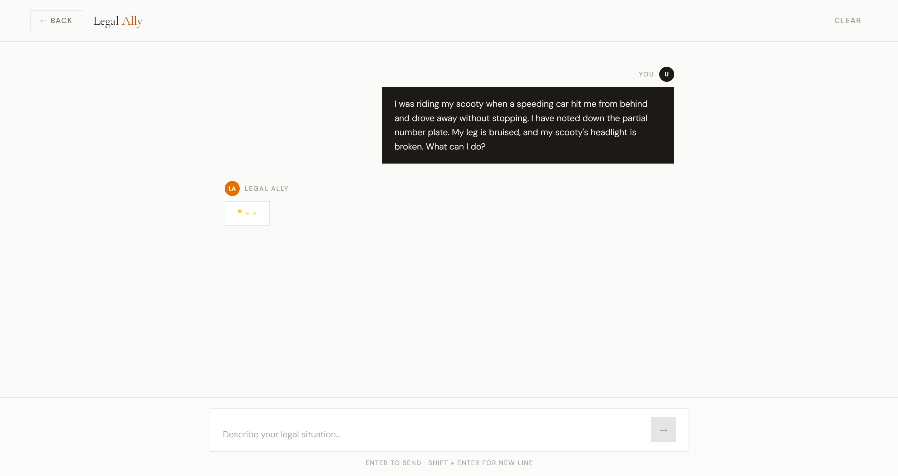

# Legal Ally

> An advanced AI-powered legal assistant that simplifies Indian law for everyone.

Legal Ally combines semantic search with large language model reasoning to deliver accurate, context-aware legal guidance grounded in the Indian Penal Code, CrPC, CPC, and other specialized acts. It is built for individuals, researchers, and legal professionals who need fast, structured answers from a trusted knowledge base.

---

## Screenshots

### Landing Page


### Chat Interface


### Legal Analysis Response


---

## Key Features

**Retrieval-Augmented Generation (RAG)** — Retrieves the most relevant legal sections from a curated knowledge base before generating any response, minimizing hallucination.

**High-Performance Reasoning** — Powered by Llama 3 via Groq for deep legal analysis and logical structuring with ultra-low inference latency.

**Semantic Search** — Uses Google Gemini embeddings and a Pinecone vector database to understand the meaning behind queries, not just keyword matches.

**Structured Responses** — Every answer is organized into four consistent sections: Offences Identified, Detailed Analysis, Next Steps, and Punishment.

**Modern Frontend** — A responsive, accessible interface built with React and Tailwind CSS, with smooth transitions via Framer Motion.

---

## Architecture

Legal Ally follows a two-phase RAG architecture.

### Phase 1 — Data Ingestion (Offline)

Before the application runs, all legal source material is processed and indexed.

1. **Raw Data Collection** — JSON files covering IPC, CrPC, MVA, CPC, and other acts, each with varying internal structures.
2. **Preprocessing** — A custom `preprocessing.py` script normalizes all files into a consistent `{id, text, metadata}` format, handles nested CSV strings (e.g., in the Hindu Marriage Act), and cleans text artifacts.
3. **Embedding** — The cleaned dataset is passed through Google's Gemini embedding model, producing 3072-dimensional vectors per document chunk.
4. **Vector Storage** — Vectors are upserted into a Pinecone index for fast semantic retrieval.

### Phase 2 — Query Execution (Online)

<div align="center">

```
┌─────────────────────────────────────────────────────────────────────┐
│                         USER INTERACTION                            │
│                                                                     │
│         ┌─────────────────┐         ┌─────────────────┐            │
│         │   User Query    │────(1)──▶│ React Frontend  │            │
│         └─────────────────┘         └────────┬────────┘            │
└──────────────────────────────────────────────│─────────────────────┘
                                               │ (2) POST /chat
                                               ▼
┌─────────────────────────────────────────────────────────────────────┐
│                        BACKEND PROCESSING                           │
│                                                                     │
│                    ┌───────────────────────┐                        │
│                    │    FastAPI Server     │                        │
│                    └──┬────────────────┬──┘                        │
│                       │                │                            │
│              (3) Embed query    (6) Context + query                 │
│                       │                │                            │
│                       ▼                ▼                            │
│          ┌──────────────────┐  ┌────────────────────┐              │
│          │  Google Gemini   │  │   Groq — Llama 3   │              │
│          │  Embeddings API  │  │   (LLM Reasoning)  │              │
│          └────────┬─────────┘  └─────────┬──────────┘              │
│                   │ (Vector)              │ (7) Structured response  │
│                   └──────────┐  ┌────────┘                         │
└──────────────────────────────│──│──────────────────────────────────┘
                               │  │
                    (4) Semantic search  (8) JSON result
                               │  │
                               ▼  │
┌──────────────────────────────┴──────────────────────────────────────┐
│                          KNOWLEDGE BASE                             │
│                                                                     │
│                    ┌───────────────────────┐                        │
│                    │      Pinecone DB      │                        │
│                    │   (Vector Database)   │──(5) Relevant context──┘
│                    └───────────────────────┘                        │
└─────────────────────────────────────────────────────────────────────┘
```

| Step | Action |
|:----:|--------|
| 1 | User submits a legal query via the React frontend |
| 2 | Frontend sends `POST /chat` to the FastAPI backend |
| 3 | Backend embeds the query using Google Gemini |
| 4 | Embedding vector is used to search Pinecone semantically |
| 5 | Most relevant legal sections are returned as context |
| 6 | Context and original query are sent to Llama 3 via Groq |
| 7 | Llama 3 returns a structured legal analysis |
| 8 | Backend sends the JSON response back to the frontend |
| 9 | Frontend renders the structured answer to the user |

</div>

---

## Tech Stack

| Layer | Technology |
|---|---|
| Frontend | React.js, Tailwind CSS, Framer Motion, Vite |
| Backend | FastAPI, LangChain |
| LLM Inference | Groq API (Llama 3) |
| Embeddings | Google Gemini (`text-embedding-001`) |
| Vector Database | Pinecone (serverless) |

---

## Installation

### Prerequisites

- Node.js and npm
- Python 3.10 or higher
- API keys for Groq, Google Gemini, and Pinecone

### 1. Clone the Repository

```bash
git clone https://github.com/dhruv0050/Legal-Ally
cd Legal-Ally
```

### 2. Backend Setup

```bash
cd Backend

# Create and activate a virtual environment
python -m venv venv

# Windows
.\venv\Scripts\activate

# Mac / Linux
source venv/bin/activate

# Install dependencies
pip install -r requirements.txt
```

Create a `.env` file inside the `Backend` directory:

```ini
GROQ_API_KEY=your_groq_api_key
GOOGLE_API_KEY=your_google_api_key
PINECONE_API_KEY=your_pinecone_api_key
```

Start the backend server:

```bash
python main.py
# Runs on http://localhost:8000
```

### 3. Frontend Setup

```bash
cd ../Frontend

npm install
npm run dev
# Runs on http://localhost:5173
```

---

## How It Works

1. **Ingestion** — Legal documents are processed, chunked, and embedded into vectors using Google's embedding models.
2. **Storage** — Vectors are stored in Pinecone for fast, scalable retrieval.
3. **Query** — When a user submits a question, the backend converts it into a query vector and searches Pinecone for the most semantically similar legal sections.
4. **Reasoning** — The retrieved context and the original query are passed to Llama 3 via Groq.
5. **Response** — The model returns a structured legal analysis displayed directly in the chat interface.

---

## Covered Acts

- Indian Penal Code (IPC)
- Code of Criminal Procedure (CrPC)
- Code of Civil Procedure (CPC)
- Motor Vehicles Act (MVA)
- Hindu Marriage Act
- Negotiable Instruments Act 
- Indian Evidence Act
- Indian Divorce Act

---

> **Disclaimer:** Legal Ally is an informational tool and does not constitute professional legal advice. For matters with legal consequences, always consult a qualified advocate.